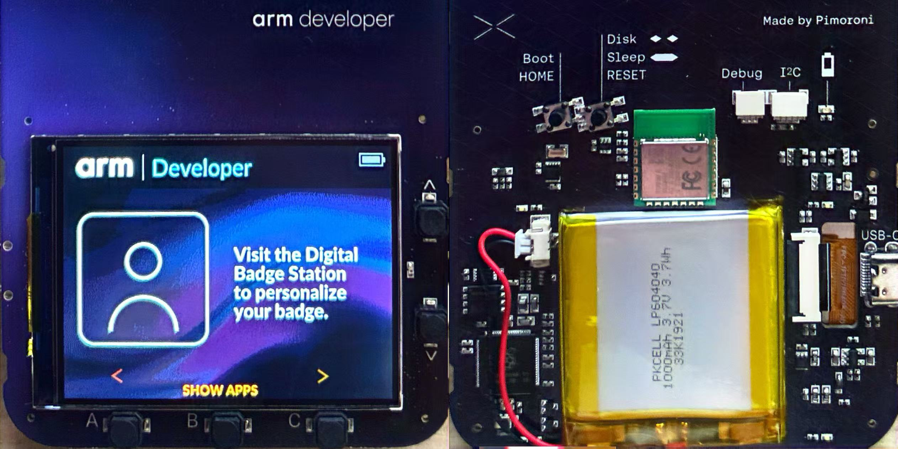
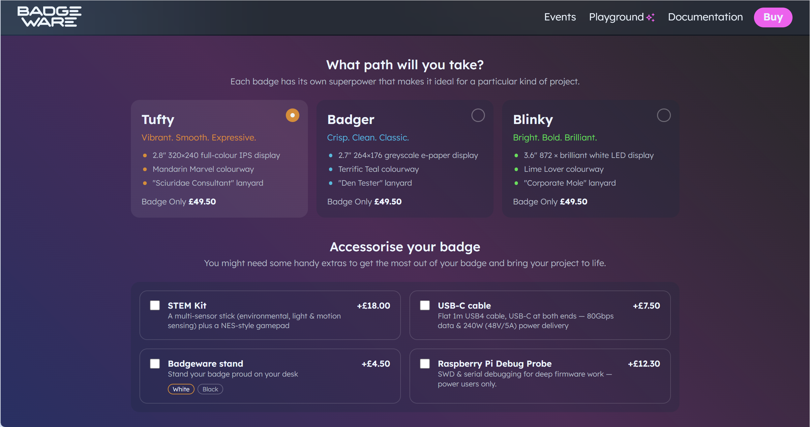
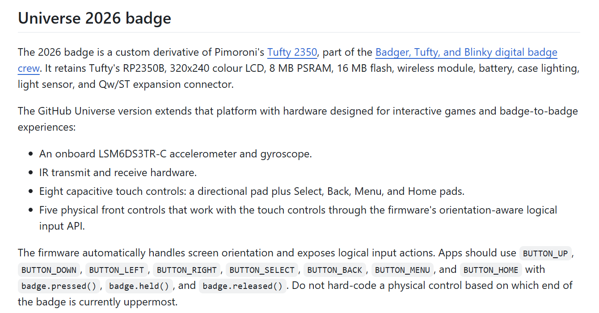
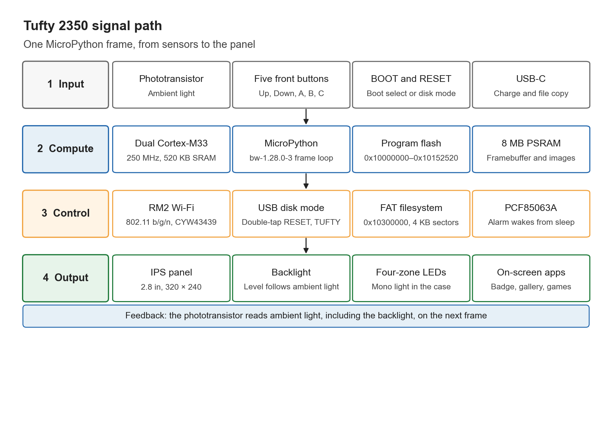
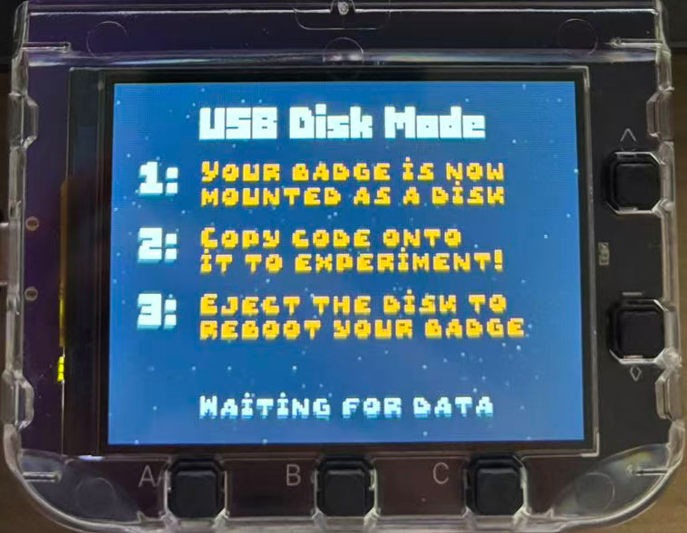
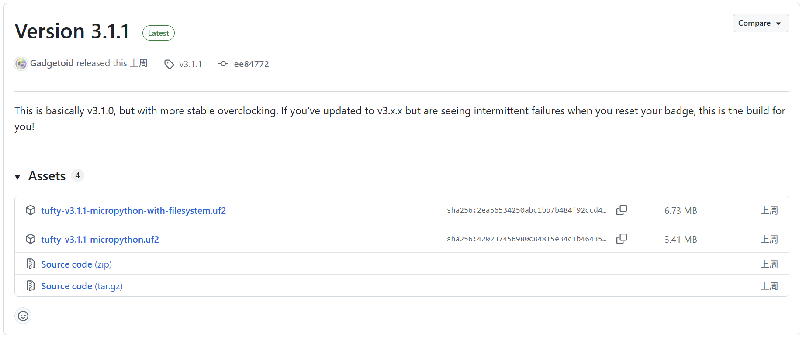
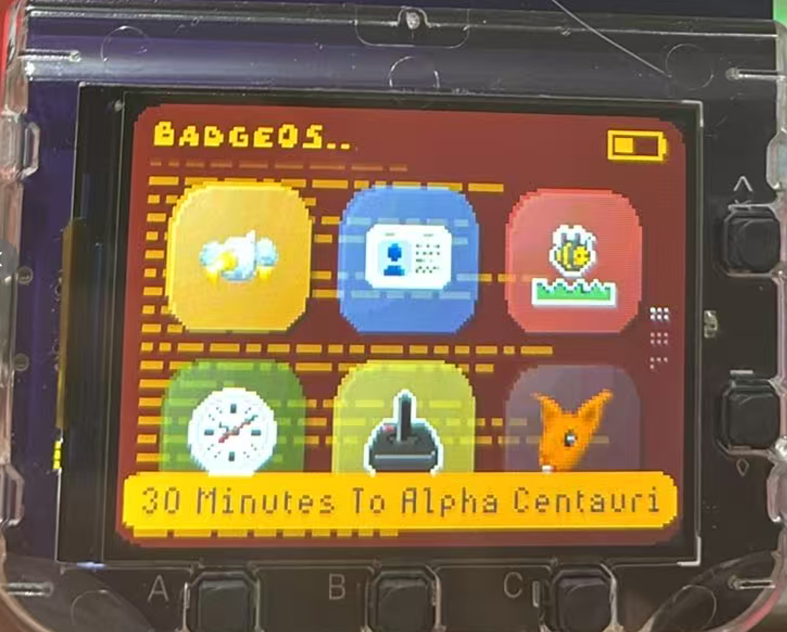
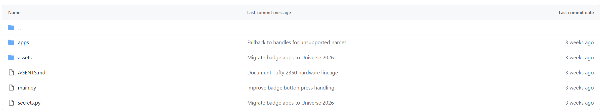
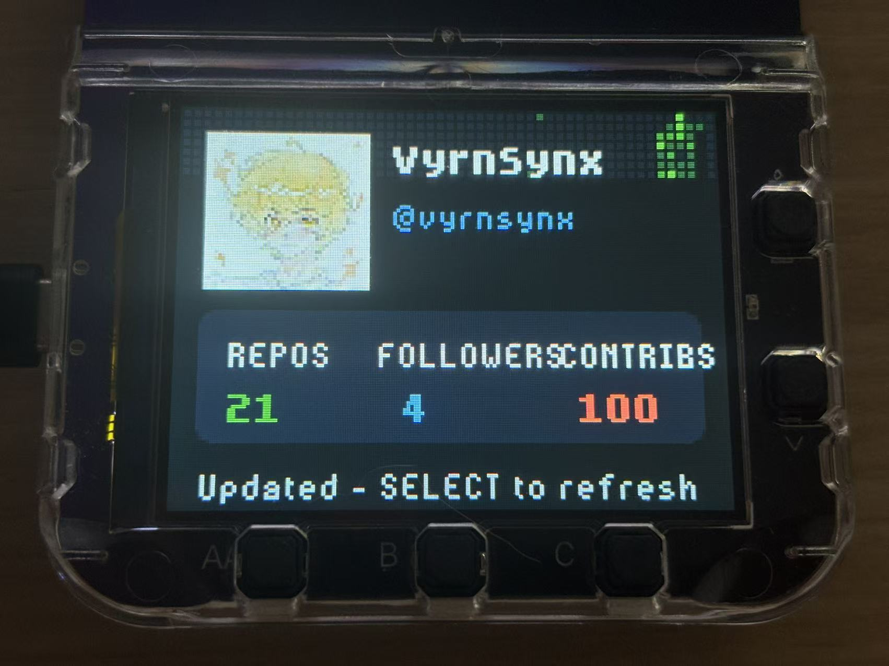

A few years ago, conference badges were usually a printed cardboard name card: hang it around your neck, glance at it once, maybe catch it in a group photo, then drop it in the recycling bin when the event ends. You couldn't change the content, and there wasn't much of a "feature set"—it only proved you'd shown up.

A friend mailed me a few of these "badges" from Arm Developer events in Shanghai and Shenzhen. When I opened the package I still expected cardboard. What came out was a small board with a color screen, buttons, and a battery. Digging into the firmware and directory layout made it clearer: MicroPython, Badgeware, an editable `profile`, an `apps/` folder you can drop scripts into—this isn't a name tag anymore. It's a programmable pocket computer you can wear on your chest.

The product is Pimoroni's Badgeware-line Tufty 2350, sitting in the smart-hardware / wearable electronic badge category. This write-up follows my own path through the board: specs and hard limits, how the software stack runs, how to edit the name card, how to flash the official packages, and the pitfalls I hit porting GitHub Universe 2026 apps onto Arm Create firmware. Tone is hands-on, not a review. Terminology note: I use **Tufty 2350** for the hardware, **Badgeware** for the MicroPython framework, and **USB disk mode** for the `TUFTY` volume that appears after a double-RESET—so we don't mix that up with a full firmware flash.

*Figure: Arm Developer custom Tufty 2350, front and back.*

## Getting to know the Tufty 2350

The Tufty 2350 is a programmable badge in Pimoroni's Badgeware lineup. Official list price is about £49.5; with the usual add-ons selected, the total can land around £91.8. As "a glowing name tag," that feels expensive. Reframe it as "a 2.8-inch, Wi-Fi/Bluetooth-capable RP2350 board that runs MicroPython," and the positioning makes more sense—you're buying a developable platform; the name-badge UI is just the skin it ships with.

*Figure: Badgeware store page and accessory upsells.*

This hardware isn't only an Arm venue thing. GitHub Universe passes have followed the same product line for the last two years; this year's edition went further with IR touch, temperature and orientation sensors, and a different button layout. I expect we'll keep seeing event-custom machines under names like "GitHub Pass": same family of boards, different peripherals and firmware. On the show floor it feels like swag; once you get home and plug in USB, the real tinkering starts. Custom editions are worth calling out separately: even on the Tufty line, button layout, IR touch, and temperature/orientation sensors all decide whether someone else's repo apps will run as-is on the badge in your hand.

*Figure: GitHub Universe 2026 badge extensions relative to Tufty 2350.*

For me the appeal is straightforward: this isn't a locked electronic name tag. You can edit `main.py`, drop scripts into `apps/`, and decide what you see on first boot. A paper badge's life ends when the conference ends; a Tufty's life starts after you leave. Next up: specs and the software stack.

## Hardware specs and hard limits

Here's the core config in one table—useful to keep open when we talk software constraints later:

| Item | Spec |
|------|------|
| Display | 2.8" 320×240 IPS |
| Input / indicators | 5 front buttons; light sensor for backlight; 4-zone LEDs on the back |
| Connector | USB-C |
| MCU | RP2350B, dual-core Cortex-M33 @ 250 MHz |
| Memory | 520 KB SRAM; 16 MB flash + 8 MB PSRAM |
| Wireless | Wi-Fi + Bluetooth 5.2 (RM2 / CYW43439) |
| Battery | 1000 mAh LiPo |
| Charge / protection | MCP73831 (~455 mA); XB6096I2S |
| RTC | PCF85063A (wake from sleep) |
| Software stack | MicroPython + Badgeware |

The charge and protection chips cover the basics of "plug in to charge, wear it while powered." The RTC makes wake-from-sleep possible instead of a cold boot through the full path every time. For a badge you use in short bursts, sleep/wake often matters more for a day's experience than raw compute numbers. The light sensor drives backlight; the four rear LED zones are handy for status or simple ambiance—details that matter when the board hangs on your chest, not decoration on a datasheet.

What it's good for: electronic business cards and branding pages, simple dashboards, pulling a bit of API data over Wi-Fi, local mini-games or demo screens. What it isn't good for: complex high-res UI, heavy compute, or long stretches of "bright backlight + Wi-Fi always on"—CPU, memory, and battery will remind you quickly. The table is an upper bound; when you actually write apps, you still have to cut against the hard constraints in the next sections. Put another way: Wi-Fi, PSRAM, and dual cores on the sheet don't mean you can pile features like a desktop mini-app—lighting up, connecting, and running are different from lasting all day on your chest.

## Badgeware and the filesystem

Badgeware is the MicroPython framework that runs on this hardware. The build I used is `bw-1.28.0-3`. Apps drive the UI with a frame loop: each frame reads input, updates state, then draws to the 320×240 screen. The idea isn't mysterious, but "don't do too much in one frame" is very real—jank shows up harder on this small display than in a desktop app. Once the frame loop clicks, debugging mostly circles around "what keys did this frame read, which layer did it draw," not around a complex backend.

*Figure: Signal path from sensors to screen in one frame.*

Flash layout is roughly:

- `0x10000000`: program region
- `0x10200000`: ROMFS
- `0x10300000`: FAT, 4096 sectors

After you connect to a computer, a double press of RESET puts the device into **USB disk mode**, volume label `TUFTY`. What you're editing then are scripts and assets on the filesystem—not a full firmware flash. Keep that distinct from "drag a uf2 and overwrite the whole chip." Day-to-day name-card edits, image swaps, and app fixes are disk-mode work; only when you change major MicroPython / Badgeware versions do you need the official uf2 / with-filesystem packages.

Versus a paper badge, the difference is obvious: content is editable, networkable, and extensible. Versus locked electronic-badge firmware, the difference is that you can reach the root tree, swap `profile`, and drop your own stuff into `apps/` instead of flipping among a few vendor pages. Badgeware ties "the badge they handed out at the venue" to "a maintainable little embedded project" on the same chain. Learning the frame loop and flash partitions isn't about memorizing addresses—it's so you know that USB disk mode mostly edits the FAT layer; the program region and ROMFS play different roles. Editing a `.py` is not the same as installing a whole new firmware build.

## Design constraints you can't ignore

After a few days with the board, I boil the limits down to a short list. Think through them before writing or porting apps—you'll avoid a lot of "it runs but it's flaky" pain:

1. **Compute and memory**: RP2350 + PSRAM have ceilings, and MicroPython still has GC. Complex structures, big image decodes, and per-frame reallocations will punch through smoothness.
2. **Power**: Backlight and Wi-Fi both burn charge. For demos that stay bright and always connected, 1000 mAh empties faster than you expect—dim when you can, disconnect when you can.
3. **USB-C mutual exclusion**: App runtime and USB disk mode don't happily share. Plugging in to edit files and wearing the badge to run an app are two different states; mix them and you'll think a change took effect when you're still in the old process context.
4. **Draw resolution**: Design UI for 320×240. Control density, type size, and icon scale have to fit this panel—don't stack like a phone UI.
5. **Boot-path mutual exclusion**: BOOTSEL, disk mode, and normal boot exclude each other. Be deliberate: are you flashing firmware, editing files, or running an app right now?
6. **Don't blindly port the ecosystem**: Even within Pimoroni's badge line, don't assume Badger / Blinky code drops in unchanged. Pins, button names, display abstractions, and whether a given sensor even exists can all differ.
7. **Secrets and network**: Wi-Fi credentials live in `secrets.py`. Apps that need the network (GitHub API calls, for example) need this filled in first—otherwise the UI opens but data never arrives, and it's easy to blame the app itself.

These aren't soft "write more elegantly and it'll be faster" tips; they're physical and firmware boundaries the badge already has. Accept the boundaries, then talk about what you can build. When I ported GitHub Universe apps, most of the time wasn't "new features"—it was confirming whether touch exists, whether button names match, and whether this frame is still chewing Wi-Fi. Internalize the constraint list early and you'll yank the cable into disk mode fewer times later.

## Getting started: USB disk mode and directory layout

The day-to-day edit path is short. Muscle-memorize it:

1. With the device powered, double-RESET into USB disk mode (volume label `TUFTY`).
2. Edit files under `/system` on that volume.
3. Eject safely, reset, and boot normally into the scripts you just changed.

*Figure: On-screen prompt when entering USB disk mode.*

Two more reminders: USB disk mode is for **editing files**, not flashing a full firmware package; when you enter firmware-related modes the screen goes dark—don't assume the hardware died. Always eject safely before reset after file edits, or you can get incomplete writes that look like "I changed it, but boot still behaves the old way."

*Figure: `/system` root contents in USB disk mode.*

Typical layout under `/system`:

| Path | Role |
|------|------|
| `main.py` | Entry / main-loop related |
| `svg.py` | SVG support |
| `branding.py` | Branding presentation |
| `profile.py` | Name-card fields (name, etc.) |
| `secrets.py` | Sensitive config such as Wi-Fi |
| `apps/` | Application directory |
| `assets/` | Static assets such as images |

Once "where to edit / where it runs" is nailed down, flashing official packs, swapping apps, and porting rarely scramble the tree. My habit: touch only `profile` and `assets` first, confirm disk mode and reset flow, then move into `apps/`. `secrets.py` holds Wi-Fi info—when you copy the tree for backup, don't paste real passwords into a public repo or a screenshot.

## Editing the name card and flashing official firmware

To see your own name first, edit fields like `FIRST_NAME` in `profile.py` and replace `profile.png` with your photo or logo. Lowest cost, fastest feedback: eject, reset, and the screen on your chest should show a different person.

*Figure: Filling in name-card fields in `profile.py`.*

One caveat: on Arm Create's bundled firmware, some social fields barely do anything, and there's no usable QR display. Don't fill a pile of links expecting a full social-card app; get the name and header image right first. Event firmware often splits the difference between "show the host brand" and "stay editable"—if a field doesn't stick, it's usually because the firmware never wired it up, not because you mistyped the filename.

*Figure: Arm Developer electronic name-card UI after editing `profile` (avatar and personal info).*

When you flash official MicroPython / Badgeware, you'll see two package flavors:

- `tufty-vX.X.X-micropython-with-filesystem`: full package including the filesystem
- plain `.uf2`: closer to firmware-only

*Figure: Official firmware download page: versions and file list.*

I used the **with-filesystem** path so I could edit `profile` and apps on the disk directly. Use whatever version string the download page offers at the time; I'm not pinning a three-digit version here so it doesn't drift from what's online. Flashing the big package is "swap the base"; editing `profile` is "swap the name-card content"—the first is rare, the second is frequent. Don't reflash the whole thing every time you want a new name. For a new header image or name, USB disk mode is enough; only reflash the full package when the system misbehaves or you deliberately need to match a specific official with-filesystem build.

*Figure: Prompt after dragging in the with-filesystem firmware package.*

*Figure: Badgeware app UI after flashing official firmware.*

## Porting GitHub Universe 2026: errors and fixes

GitHub Universe 2026 didn't ship a "one-shot flashable" full official firmware package. In practice it's **file-level replacement**: copy apps and related scripts into an existing Badgeware filesystem, then chase API mismatches as they error out. Set expectations: this isn't one-click migration—it's adapting same-family hardware with different peripherals and API names. No official full package forces you to understand filesystem layout and button abstractions—painful once, much easier the next time you ship your own apps.

*Figure: Copying GitHub Universe 2026 app files onto the TUFTY volume.*

I mainly hit two classes of problems.

**1. Touch API**  
Calling `badge.touched()` raised `AttributeError` immediately. This Arm / generic Tufty firmware doesn't expose the Universe special-edition IR touch API. Strip those calls, or wrap them in a "use if present, skip if not" branch—don't assume touch exists. Special-edition sensors are a hardware difference; you can't fill that gap with a missing library file.

**2. Button naming**  
Universe-side code often uses names like `BUTTON_LEFT` / `BUTTON_RIGHT` / `BUTTON_SELECT`; on this firmware they map to A / B / C and friends—roughly: A left, C right, B open, up/down for line movement. Once the mapping is right, menus and lists behave again. Matching names *and* feeling the logic on device is the real bar; renaming strings without checking the physical buttons leaves you with "I can open the menu but can't select anything" fake fixes.

*Figure: `AttributeError` from a missing touch API.*

*Figure: `NameError` from undefined button constant `BUTTON_RIGHT`.*

After fixing button and touch differences, about 22 apps ran; a few that hard-depend on temperature, orientation, or touch sensors from the special edition still fail. That's a hardware capability gap, not something two more renames can paper over. Apps that hit the GitHub API also need Wi-Fi configured in `secrets.py` first—otherwise the UI opens and the data never shows.

*Figure: GitHub info app UI running after the fixes.*

I used AI assistance to speed up mapping and exception branches, but the final authority was still real buttons and the correct boot path. AI can guess "this constant probably maps to that key"; it can't confirm you didn't confuse BOOTSEL / disk mode / normal boot. Temperature, orientation, and IR touch from the Universe special edition are simply missing on generic / Arm Create hardware—mark those apps as hardware exceptions in your port list rather than forcing the errors away.

## What else to build, and an open repo

Beyond the name card and official demos, useful directions include: local utility screens, on-site event boards, light networked dashboards, and hanging your own scripts under `apps/`. The section-four constraints still apply—resolution, power, and mutually exclusive modes first, features second. Ship "one screen, one job" apps before trying to stack a full dashboard. Make network features degrade gracefully: local pages still work offline, pull APIs only when connected—otherwise one dropped Wi-Fi session makes the whole badge look broken in a live demo.

I've published the Arm Developer / Arm Create firmware and related files I cleaned up in a public repo. As far as I've seen, it's one of the more complete Arm Create-side references you can work against directly:

https://github.com/vyrnsynx/tufty-arm-create

If you have a Tufty 2350—or you just carried a glowing conference badge home—start by editing `profile`, then open USB disk mode and walk `/system`. Paper badges end when you leave the venue; this pocket computer on your chest starts afterward. If you're collecting Arm Create or Universe files too, issues against the repo are welcome. I wrote this note for a simple reason: leave the pitfalls as trail markers so the next badge doesn't spend the rest of its life as drawer swag.
