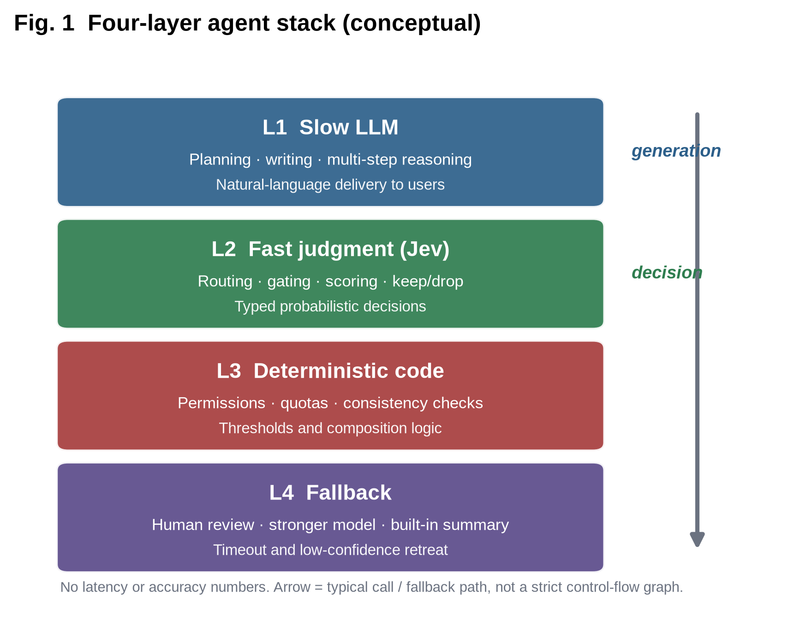
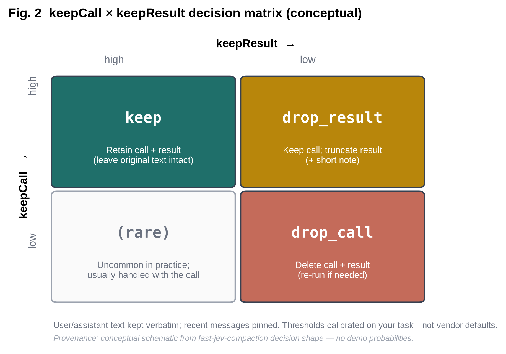
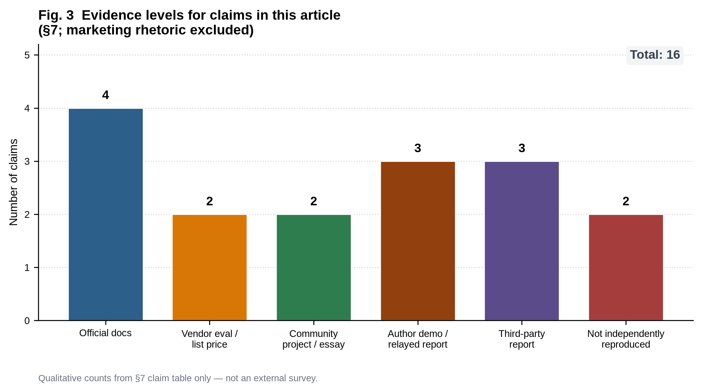
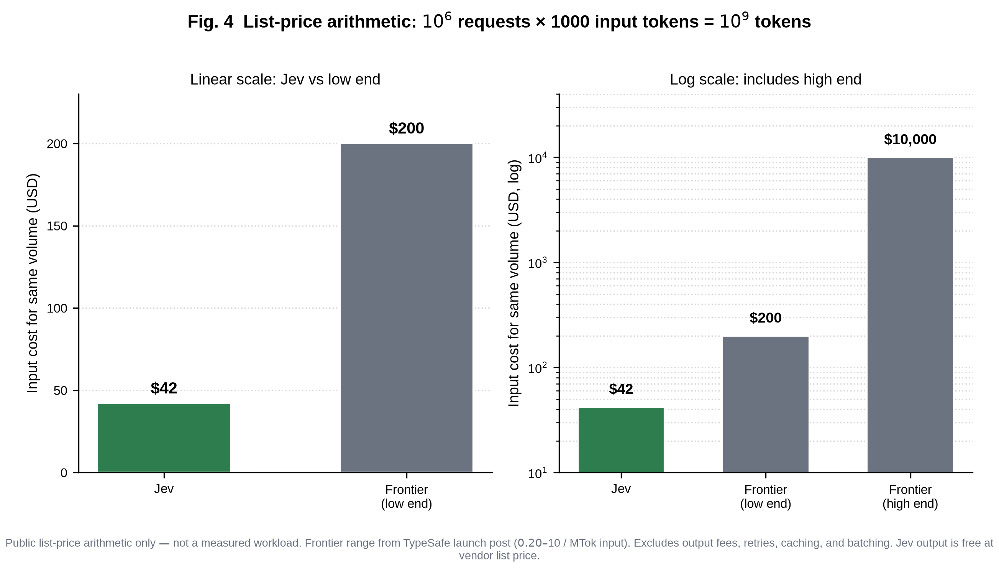

**Most agent calls are decisions, not essays.** Routing, gating, scoring, and keep-or-drop compaction need a typed answer the code can branch on—not another paragraph that happens to parse as JSON. TypeSafe's Jev is one bet on that split: a fast decision layer beside the chat model. This piece maps the interface, the failure modes, and what is actually verifiable so far.

> Synthesis based on TypeSafe's launch materials (2026-09-15), docs.typesafe.ai, community projects `fast-jev-compaction` and Browser Use `jev-ultrafast`, and three anonymized community narratives (an engineering-practice essay, a product-demo essay, and a playbook). Speed and cost multiples are tagged by source—**vendor list price**, **vendor evaluation**, **community project**, **author demo**, **third-party report**, or **not independently reproduced**—and vendor or demo figures we have not reproduced are not treated as measured fact. Marketing slogans are not evidence.

---

## 1. Why pull judgment out of generation

For the past two years, agent engineering has been narrated by roughly one formula: a stronger chat model, a longer tool-calling loop, and another layer of prompts plus JSON schema. In production, teams keep hitting the same friction—**many calls do not need prose a human will read; they need a branchable decision over known state**.

Those decisions are dense in real systems and oddly monotonous in shape: which worker to route to next; whether a context span still earns its tokens; whether a tool result passes muster; whether a destructive action is allowed; whether confidence is high enough to auto-execute. Shared traits: inputs are program state and evidence; outputs are discrete options or scalars; downstream code must branch immediately—not wait for a paragraph to finish sounding coherent.

Stuffing that work into an LLM's string channel usually means a brittle pipeline: write a prompt, constrain JSON/schema, parse and retry; latency and billing both eat input *and* output tokens; "looks like valid JSON" is not "picked the right option"; and if you ask "how sure are you?", you often get a prose self-report that is hard to wire into threshold policy.

On 2026-09-15, TypeSafe founder Diogo Almeida launched the company's first public **System One model—Jev**. "System One" here is a product category name for models optimized for fast, typed decisions (as opposed to chat generation); the metaphor is Kahneman's System 1 / System 2: slow thinking stays with frontier LLMs, fast judgment goes to a specialized model. The reframing: **the model interface should emit typed decisions software can consume directly, not chat text**. "Jev" nods at Jevons' paradox—the vendor line is that cheaper units of intelligence unlock *more* automation volume, not less.

For engineering teams, the interesting question is not the category slogan. It is whether three things can hold at once: the interface contract forbids free text from the start; probabilities are first-class and code-consumable; and *jaggedness* (uneven skill across task types), *calibration* uncertainty (whether stated confidence matches real error rates), and action risk are absorbed by layering and fallback—not by writing a longer system prompt.

---

## 2. What it is: System One, three primitives, and how that differs from structured output

### 2.1 Product shape (official docs)

Per docs.typesafe.ai and the launch post, a Jev call looks like this:

- **Input:** `state` (unstructured program state / text) plus a set of typed `questions`
- **Output:** structured answers plus probability distributions (and `confidence` for Choice / Score)
- **No string generation**; multiple questions on the same `state` can be evaluated in parallel

Three primitives:

| Primitive | Question shape | Returns |
|-----------|----------------|---------|
| **Choice** | Pick one from an explicit option set | `choice` + per-option probabilities + `confidence` |
| **Score** | Score on a scale | `score` + per-bin probabilities + `confidence` |
| **Noul** | Does a proposition hold? (yes/no / truth-value) | `noul` ∈ [0,1] (already a probability; no separate `confidence`) |

The vendor stresses that `confidence` is **not** "probability of the chosen option." It is an uncertainty statistic derived from the full distribution—and it is **not** "probability of winning the game." Type safety here means: **the model cannot emit a label outside the schema** (the vendor says "mathematically impossible to have a type error"). That is **not** semantic correctness; the model can still pick the wrong *legal* option. Question field IDs also do not carry instructions: naming a field `safe_to_publish` does not get read as a prompt. Evidence belongs in `state`, separated from the raw request fields (official docs).

### 2.2 Training claim: RLCD

Launch materials name the training method **RLCD (Reinforcement Learning for Calibrated Decisions)**, with the stated goal of returning "cognitively honest" probabilities on System One tasks. As of roughly 2026-09-18–20, a third-party overview (e.g. systemonemodels.org) notes: **the name and goal are public; the reward function, dataset, and training recipe are not—and there is no independent reproduction.** Treat "calibration" as a **hypothesis to validate on your own logs**, not a default property. Probabilities of complementary propositions also need not sum to 1—the official jaggedness material flags this—so enforce consistency in code.

### 2.3 Why "LLM + structured output" is not the same contract

On the surface, both can emit "parseable structure." In engineering terms they are different contracts:

**Different parse-and-retry surface.** LLM-path failures often live at the string layer: missing braces, explanatory prefixes, drifting field names, occasional completion of the schema as prose. You need JSON mode / tool schema / validators / retry budget—and sometimes a second prompt that says "JSON only." Jev-path failures land at the semantic layer: the label is legal, but wrong; the distribution is sharp, but sharp on the wrong option. The first wastes engineering time and output tokens on parse/retry; the second wastes downstream cost on the wrong branch. Both need budget; the observation points differ.

**Different billing shape.** LLM paths usually charge for input *and* output; to "look like a decision," models often emit rationalizing prose that quietly inflates the output bill. Jev's vendor list price is **$0.042 / MTok input**, **output free** (pricing page / launch post). That does not automatically mean a lower invoice—you still have to keep `state` short and relevant—but it changes the optimization target: not generating filler becomes the default behavior, not something you coax with prompts.

**Different confidence semantics.** Asking a chat model "how sure are you (0–100)?" yields a self-reported number under prose constraints; its relationship to true error rate is often uncalibrated. Jev separates option probabilities from distribution-derived `confidence` (official semantics): the former answers "who won / relative strength"; the latter answers "how peaked or diffuse is the whole distribution." Mixing them in business logic systematically over- or under-fires thresholds.

**Different observability of success.** Structured-output "success" is often defined as `parse_ok`. Jev "success" needs different labels: was the option correct; should the threshold have fired; does low confidence actually correlate with needing a human. If teams keep parse success as the primary KPI, they overrate LLM-JSON decision quality and underrate the calibration work a decision model still requires.

| Dimension | LLM + structured output | Jev (vendor positioning) |
|-----------|-------------------------|--------------------------|
| Optimization target | Preferred / verifiable text | Typed decisions + probabilities |
| Output channel | String → parse | Native struct |
| Sampling | Autoregressive | Parallel (vendor: multi-question per request) |
| Failure mode | Illegal JSON, digression, hallucinated text | Wrong legal label, jaggedness |
| Text ability | Strong | **None** (cannot generate explanatory prose) |
| Confidence | Mostly prose self-report | Distribution-derived (official semantics; business validity is yours to test) |

The core difference is not "can it emit JSON?" It is whether **the interface contract forbids free text from the start and treats probability as a first-class citizen**.

**A failure-budget contrast.** Suppose a routing edge is hit hundreds of times per minute. On the LLM-JSON path, even a few percent parse failures create retry queues and alert noise. On a decision-model path, parse noise vanishes—but wrong labels become wrong workers immediately. The first forces investment in validators and retry policy; the second forces investment in label-set design, dynamic menus, and calibration logs. Neither path is "free correctness"—they just spend money and time on different fault surfaces.

**Parallel questions change composition.** The vendor supports evaluating multiple questions on the same `state` in parallel, with questions invisible to each other. You cannot sneak "look at Score first, then decide Choice options" into inter-question dependencies within one request. The right pattern: shrink candidates in code first, then fire independent questions together—or accept a second round. Speculative branching (ask several possible next steps, then take only the relevant answers in code)—emphasized in the playbook piece—only works when questions are independent. That is the opposite of an LLM's habit of "thinking while revising options" inside one generation—and it is part of the contract difference.

### 2.4 Public numbers (keep the grades straight)

- **List price (vendor):** **$0.042 / MTok** input (MTok = million tokens; i.e. **$42 / billion tokens**); output free. TypeSafe also states it **cannot prove pricing is unsubsidized**; sustainability needs long-horizon verification.
- **Latency (vendor):** roughly **70–500 ms** end-to-end; for System One–shaped queries vs frontier, the vendor claims about **40×–200×** faster.
- **Homepage workflow eval highs (vendor evaluation, not independently reproduced):** **193.6×** faster, **444.6×** cheaper—the launch post calls these high-end figures from their own workflow eval (reference is frontier-model average, not ground truth).
- **Architecture and weights:** not public; weights not open source.
- **Funding (third-party report):** about **$40M** seed, **DCVC** lead (FinSMEs / Business Wire, cited as financing news).
- **Founder:** Diogo Almeida; company materials say he worked on OpenAI-side RLHF / InstructGPT–related efforts—background, not proof that calibration is solved.

Known jaggedness (third-party overview citing official docs): weak at counting / arithmetic and treating dates as ordered quantities; tends to read questions literally; injection risk when user text enters `state`; **cannot generate text**.

Those limits matter less if you treat Jev as one layer in a stack—not as a drop-in chat replacement. Section 4 spells out that stack; Fig. 1 previews it.

*Fig. 1. Conceptual schematic: slow LLM / fast judgment (Jev) / deterministic code / fallback. No performance numbers.*

---

## 3. Three complementary community angles: practice, demo, playbook

Once a typed decision API exists, the next question is how teams actually wire it. Public write-ups cluster into three complementary angles—not competing camps so much as different cuts on the same problem. Handles and accounts are omitted on purpose; what matters is the argument shape. The table contrasts those shapes.

| Dimension | Engineering-practice piece | Product-demo piece | Playbook piece |
|-----------|----------------------------|--------------------|----------------|
| Core metaphor | Most agent calls are **judgment, not generation**; Jev as a **fast judgment layer** | Jev as the **player holding the controller**; code as the **game engine** | **LLM creates work → decision model chooses the next step**; split "pick worker / check result / continue?" into inspectable, billable components |
| Architecture claim | Slow LLM / fast judgment / deterministic code / fallback; selection matrix and degradation ladder | Emphasizes real-time control feel and "engine constrains intelligence"; four use-case families | 10-step path: identify judgment edges → Playground → API/SDK → local queue handoff → primitive choice → dynamic menus → parallel questions → stop points and budgets → list-price arithmetic → use cases |
| Representative cut | `fast-jev-compaction`: keep/drop rather than paraphrase | Ultra-short demos in the style of Browser Use (an open-source browser-automation agent) | Standalone task-router starter; rebuild Choice from currently available options (Browser Use pattern); same-family performance numbers relayed by the playbook author |
| Tone | Reversible, auditable, admits jaggedness | Optimistic but early; competition from LLM vendors and classic classifiers | Operations manual plus marketing rhetoric; slogan-level lines = **opinion/hype, not evidence** |
| Numbers | Demo tables labeled **original author demo data** | Single-recording durations labeled **author recording, not extrapolable** | List-price arithmetic is recomputable; Browser Use / paper-classification / safety-classification figures labeled **project report or third-party claim, relayed—not measured here** |

### 3.1 What the playbook adds (contrast summary, not a step-by-step copy)

Aligned with the other two paths: many expensive LLM calls never needed generation—only routing, scoring, approval, or escalation. The playbook's difference is naming everyday forks as **independently inspectable and billable judgment components**, plus a follow-along path (topic-level summary):

1. **Draw judgment edges.** In a task like "research several tools and draft a briefing," hand "enough sources? / who works next? / ready for review?" to the decision model; fetching, paragraph writing, and file I/O stay with tools and generation models; hard rules like "stop after ten steps" stay in code.
2. **Playground, one question:** `state` + Choice "next worker?" → `research` / `write` / `review`.
3. **API + official SDK** (and optional skills repo) in one wiring pass.
4. **Persist JSON handoffs** into local `queue/{research,write,review}`; the piece uses confidence threshold **0.85** as an **author starter**, and reminds that confidence ≠ accuracy percentage—**not** a calibrated universal default.
5. **Pick primitives:** Choice / Score / Noul; question IDs carry no instructions; evidence goes in `state`.
6. **Dynamic menus:** follow Browser Use—rebuild options from **currently available workers/controls**, not yesterday's menu; Choice cap **255**; for large candidate sets, filter in code → Score → Choice.
7. **Parallel / speculative questions:** same `state`, multiple questions (mutually invisible); relays Browser Use `jev-ultrafast` docs: browser-protocol call median **1092→101**, matched-pair median task duration down ~**25%**—labeled **project report relayed via community playbook, not measured here**.
8. **Stop points:** action budgets, spend caps, progress checkpoints; once a task is marked done, completion checks stay separate from the routing decision itself.
9. **List-price arithmetic:** $0.042/MTok; if each decision is ~1k billed input tokens, 10k decisions ≈ **$0.42** (recomputable list-price math). Flight demo reported **$0.0039 / ~7 s** (find flights, do not book) = Browser Use project report, relayed; another team's safety classification vs a strong model ≈ **5–18×** faster = **third-party claim, relayed—not verified here**.
10. **Use-case sketches:** browser control; batch paper classification (e.g. 1018 papers, ~$0.08, median ~256 ms—**third-party figures, relayed**); inbox triage; route tasks between cheap and strong models (LangChain-style routing layer).

**Vs the other two sources.** The playbook barely develops jaggedness, shadow mode, or L1/L2/L3 action risk (those are the practice piece's gates); nor does it lead with "controller / engine" (demo piece). Its increment is: **handoffs as consumable local-queue JSON, and dynamic option menus as first-class design**. Tweet-style slogans (Internet moment, save 101%, 2030 setup, etc.) are marketing rhetoric; this article **does not put them in the engineering column of the verifiable-claims table**.

---

## 4. Engineering layers: four-layer stack and each layer's failure modes

The practice angle's lasting contribution is a failure-mode map. Combining that layering with the official "atomic questions + compose in code" advice, a maintainable agent stack can be written as four layers (Fig. 1). The payoff is not "more boxes on a diagram"—it is **isolating unreliability on observable judgment boundaries**.

### 4.1 Slow-thinking layer (frontier LLM)

**Job:** Planning, writing, multi-step reasoning, anything that must deliver natural language to a user; any scene that needs an explanation a human will read.

**Typical failures:** Long-context drift; tool-call hallucination (inventing APIs that do not exist); over-rationalizing false premises; generating non-executable steps to "make the story add up." Using this layer for high-frequency gating amplifies generation jitter into routing jitter.

**Engineering response:** Shrink this layer's call surface; push discrete branches down to fast judgment; split outward copy from inward decisions.

### 4.2 Fast-judgment layer (Jev or similar decision models)

**Job:** Classification, routing, gating, scoring, context keep/drop, first-pass guardrails. Keep questions atomic; split multi-factor tradeoffs into multiple questions and weight them in code.

**Typical failures:** Wrong legal label; over-sharp distribution on the wrong option; jaggedness (counting, arithmetic, date order); literal question reading ("option text matches, state evidence does not"); `state` injection (untrusted user text treated as evidence).

**Engineering response:** Atomic questions + explicit option menus (rebuilt with state); low confidence must not drive high-risk actions; force complementary propositions consistent in code; quarantine or summarize untrusted text into controlled fields before it enters `state`.

### 4.3 Deterministic layer (ordinary code)

**Job:** Schema validation, quotas, permissions, idempotency, complementary-proposition consistency, hard stops (step count, spend, time box).

**Typical failures:** Treating model probabilities as business invariants; missing idempotency (double charge / double email); dynamic menus out of sync with the real available tool set ("yesterday's menu").

**Engineering response:** Anything that "must be true" lives in code, not prompts; rebuild Choice options from currently available workers/controls; for large candidate sets, filter → Score → Choice.

### 4.4 Fallback layer

**Job:** Low confidence → human / stronger model; service failure → built-in policy; insufficient compression → summarize or refuse further auto-deletion.

**Typical failures:** Fallback itself unobservable (silent swallow); fallback costlier than the main path with no budget; thresholds frozen as documentation example values.

**Engineering response:** The community project `tamaratran/fast-jev-compaction` (MIT; npm + Claude Code plugin) encodes "if not worth it or on error, fall back to built-in summary"—shape reference, not an SLA. Every failure class needs an explicit path and a metric.

---

## 5. A representative cut: context compaction — keep/drop, not paraphrase

Coding agents' context cost rarely comes from "the user said one more sentence." It comes from tool traces: long logs, repeated file reads, failure stacks, intermediate command output. Traditional `/compact` leans on an LLM to **rewrite a summary**—and paths, raw error text, and exact commands can get smoothed away. Once the summary is wrong, the assistant cannot faithfully replay; it keeps guessing on contaminated memory.

`fast-jev-compaction` cuts the other way:

- Ask two Noul questions over historical **tool call / tool result**: `keepCall`, `keepResult`
- Keep user and assistant text **verbatim**
- Pin the most recent messages; they are not deletion candidates
- Decision matrix (conceptually):

| | keepResult high | keepResult low |
|--|-----------------|----------------|
| **keepCall high** | **keep** (retain originals) | **drop_result** (keep call; truncate result) |
| **keepCall low** | (rare in practice; usually handled with the call) | **drop_call** (delete call + result) |

Deleted tool traces can, in principle, be **re-executed**—decisions are reversible. When `state` is too large, walk a degradation ladder (the project calls this fitState: shrink or summarize state until it fits the decision call); if compression is insufficient or the decision service is down, fallback.

**Why paraphrase is especially dangerous for coding agents.** Critical information is highly non-natural-language: absolute paths, exit codes, byte-level diffs, exact repro commands. Summary models tend to generalize them into "fixed a config issue" / "re-ran tests," and downstream reasoning loses executable anchors. Keep/drop turns compaction from a **generation problem** into a **judgment problem**: decide which original span to keep; do not invent a replacement narrative.

The keepCall/keepResult **demo numeric tables in the practice piece are original author demo data**; this article does not relay specific probabilities lest they be misread as a general benchmark. The engineering value is the **decision shape**: cheap fast judgment for reversible deletion, not expensive generation for irreversible rewrite.

**Cost structure vs generative compaction.** Paraphrase's marginal cost rises with the length of history being summarized, and every summary introduces irreversible information loss. Keep/drop's marginal cost is mostly the input `state` size of two Noul judgments; the loss is reversible deletion (tools can be re-run). Of course, if a tool is not replayable (one-time codes, already-consumed external side effects), `drop_call` is no longer "free reversible"—promote that trace to an L2/L3 protected object rather than handing it to auto-compaction.

**Threshold calibration is still required.** The matrix gives shape, not numbers. How high `keepResult` must be is labeled by *your* judgment of "can we still fix the bug / will we re-hit the same landmine after deletion"—not copied from any demo table. A stretch of **shadow mode** (run the decision in parallel, log what it would delete, but do not act yet—then sample human replay) is usually safer than auto-dropping on day one.

The product-demo piece uses a "controller vs engine" analogy for the same idea: the judgment model supplies control signals; game rules and state machines stay in code. Its cited Browser Use `jev-ultrafast` single recording (~17 decision calls + 2 text generations, total ~7.073 s) is **author recording data, not extrapolable to a product SLA**. Same-family protocol-call medians and task-duration changes appear in §3 (playbook relay); treat them uniformly as project reports, not measurements in this article.

*Fig. 2. Conceptual decision matrix: keep / drop_result / drop_call. Thresholds are business-calibrated; vendor defaults are not automatically optimal.*

---

## 6. Selection and risk: calibration, shadow mode, action risk, and the competition triangle

### 6.1 When to prefer a decision-model interface

- High-frequency gating / routing / scoring with little need for text
- You need **explicit probabilities** for thresholds—not another parse of "I feel pretty sure"
- You want multiple questions on the same state in parallel, composed in code
- You can accept **no textual explanation** (explanations go through an LLM separately)
- Option sets are enumerable and, ideally, rebuildable from the environment

### 6.2 When not to force it

- You need user-visible copy, long reasoning chains, or open-domain writing
- Heavy dependence on counting, arithmetic, or date order (jaggedness)
- Untrusted user text dumped into `state` with no isolation (injection surface)
- Equating "type-safe" with "decision-correct"
- Stable label sets and hand-writable features—classic classifiers may be simpler and more explainable

### 6.3 Confidence vs option probability; calibration and shadow mode

**Option probability** answers: given this label set, where does mass land. **`confidence`** (official semantics) answers: how concentrated / uncertain is the whole distribution. When they agree, life is easy; when they disagree, danger—e.g. a wrong option has high probability *and* high confidence, so the system is "very sure" while being wrong.

Suggested rollout:

1. **Shadow mode:** log `(question type, option distribution, confidence, post-hoc correctness / human label)` only—do not drive actions.
2. **Binned reliability diagrams:** bucket by confidence or max option probability; check that empirical accuracy is monotonic.
3. **Then set thresholds:** from *your* curve, not documentation examples (e.g. a playbook starter's 0.85).
4. **Escalate actions:** drive L1 first, then L2, and only then consider L3.

Competitive pressure comes from cheaper LLM structured output *and* classic classifiers / rules; the demo piece also notes that early optimism should be paired with replaceability design.

### 6.4 Action-risk tiers (L1 / L2 / L3) with agent examples

| Tier | Agent-side examples | Suggested gate |
|------|---------------------|----------------|
| **L1** | Debug labels on a trace; UI hint "suggest a human look"; drop non-destructive cache; adjust log sampling | Lower confidence can auto-fire; still audit samples |
| **L2** | Route to a more expensive model; truncate tool results (`drop_result`); rate-limit / defer noncritical workers; context keep/drop | Medium threshold + full audit log; replayable |
| **L3** | Outbound email / PR comments; charges and orders; irreversible tools or DB deletes; merge to main; silence alerts | High threshold + human or dual-model confirm; ban single-model single-threshold |

A common coding-agent mistake: treating "delete a tool result" as L1—if that was the only failure stack, later loops re-hit the landmine, so it is closer to L2. A common browser-agent mistake: treating "click submit" as L2—if submit equals order or send, treat it as L3.

### 6.5 Competition triangle: decision model vs LLM-JSON vs classic classifier

When you put Jev in a selection table, keep at least two other columns:

- **Classic classifier / rules:** Stable label sets and engineerable features often still win on latency and explainability. Decision models fit better when label semantics drift with natural-language state and features are hard to hand-write.
- **LLM + structured output:** More natural when you also need an explanation, or judgment is coupled to writing. Cost: parse-failure surface and output billing. A decision model's comparative advantage should sit in the "pure judgment, high frequency, needs probability gates" subset—not a claim of wholesale replacement.
- **Jev-class interfaces:** Native structs, vendor list price free on output, parallel multi-question, probability as first-class; weaknesses: no explanation text, jaggedness, calibration must be self-proven, vendor lock-in and opaque weights.

Run the same eval set three ways: accuracy, calibration error (e.g. ECE—Expected Calibration Error), p50/p95 latency, cost per decision, and **refusal / human-escalation rate**. Without the last, high accuracy may just be pushing risk onto production. Abstract a `JudgmentProvider` so the three paths can hot-swap—cheap insurance early on.

### 6.6 How to read the vendor workflow eval

TypeSafe's launch post describes its own methodology: fixed code workflows; reference answers are the average of two frontier models' probabilities, not ground truth; homepage 193.6× / 444.6× are flagged as high-end. For engineers that means:

- The number measures "fit to a reference graph + cost/latency," not an absolute correctness leaderboard
- Multiples favor workflows where many independent subproblems can be parallelized and merged; "swap the model for a single classification" may shrink dramatically
- Internal POCs should cover both shapes so you do not only copy the shape that favors the vendor
- Treat these multiples as an **upper-bound narrative**; measure latency and cost on *your* workflows—do not write them into external SLAs

### 6.7 Honest boundaries: jaggedness, RLCD, multiples, and marketing rhetoric

- **Jaggedness:** Weak counting/arithmetic, dates not ordered quantities, literal question reading, `state` injection, no text generation—known limits, not "another temperature tweak will fix it."
- **RLCD:** Name and goal public; method not; third-party overview: no independent reproduction—do not write "calibration proven."
- **Vendor multiples:** 40×–200×, 193.6×, 444.6× are vendor evaluation / list-price framing; independent aggregate benchmarks still looked thin from the ~2026-09-18–20 third-party overview vantage.
- **Community demos and relays:** Browser Use recording duration, protocol-call changes, flight-demo cost, paper-classification cost/latency, a team's safety-classification multiple—all treated as author demo or third-party claim, relayed.
- **Marketing rhetoric:** Internet moment, save 101%, 2030 setup, etc.—not engineering evidence.

---

## 7. What you can take to the bank—and what you cannot

A short ledger of claims that appear above, with how strongly they are supported. Skim the bold tags; skip rows you do not need.

| Claim | Evidence posture |
|-------|------------------|
| Three-primitive API, no string generation, parallel multi-question | **Verifiable** (official docs / API) |
| Cannot emit out-of-schema labels | **Falsifiable** (vendor: mathematical guarantee; a single counterexample would break it) |
| List price $0.042/MTok, output free | **Vendor list price**; sustainability **vendor-admitted unproven** |
| ~70–500 ms latency | **Vendor-claimed, measurable in principle**; region and load matter a lot |
| 40×–200× / 193.6× / 444.6× | **Vendor evaluation**; launch post calls highs high-end; **not independently reproduced here** |
| RLCD name and calibration goal | **Public**; method and reproduction **not public / not independently reproduced** |
| `confidence` derived from distribution, ≠ option probability | **Official semantics**; business validity requires your own tests |
| Semantic accuracy, general "intelligence multiples" | **Do not take marketing at face value**; test on your task set |
| $40M / DCVC | **Third-party financing report** |
| `fast-jev-compaction` exists and is MIT | **Community project, verifiable** |
| Practice-piece demo tables / demo-piece Browser Use recording duration | **Author demo**, not a general benchmark |
| Playbook thesis: LLM generates → decision model chooses next step; judgment components inspectable/billable | **Community author view** (aligned with the other two paths; not an independent benchmark) |
| Browser Use protocol-call median 1092→101; matched-pair median task duration −25% | **Project docs relayed via community playbook**; not measured here |
| Flight demo $0.0039 / ~7 s (find flights, do not book) | **Browser Use project report, relayed** (same family as demo recording; not an SLA) |
| Paper classification: 1018 papers / $0.08 / median 256 ms | **Third-party claim, relayed** |
| Safety classification ≈5–18× vs strong model | **Third-party claim, relayed**; not verified here |
| "Internet moment / save 101% / 2030 setup" etc. | **Marketing rhetoric**; not engineering evidence |

*Fig. 3. Qualitative counts from the §7 claim table (marketing rhetoric excluded), bucketed by evidence level—not an external survey.*

*Fig. 4. Public list-price arithmetic only: \(10^6\) requests × 1000 input tokens = \(10^9\) tokens → Jev input cost $42. Comparison columns use the frontier input range $0.20–$10/MTok cited in the vendor launch post, same input volume. Excludes output fees, retries, and caching; not a measured workload.*

---

## 8. Shipping checklist (executable, not slogans)

1. **Map the call graph first.** Mark which agent edges are judgment vs generation; pilot only judgment edges onto a decision model.
2. **Atomicize questions.** One meaning per question; split multi-factor cases; put weights in code; rebuild option menus with state.
3. **Shadow → L1 → L2 → L3.** No logs, no calibration; no calibration, no thresholds; example thresholds are starters only.
4. **Constrain complementary propositions yourself.** Do not assume \(P(A)+P(\neg A)=1\).
5. **Prefer keep/drop for compaction.** Delete before you rewrite; keep user/assistant originals and replayable tool traces.
6. **Design fallback in.** Missing keys, timeouts, insufficient compression ratio, low confidence—each gets an explicit path and a metric.
7. **Treat vendor multiples as upper-bound narrative.** Measure latency and cost on your workflows; cover at least "single classification" and "multi-step merge" shapes.
8. **Security.** Isolate untrusted text before it enters `state`; L3 actions forbid single-model single-threshold.
9. **Replaceability.** Abstract `JudgmentProvider`; keep LLM-JSON and classic-classifier back doors.
10. **Document evidence grades.** Internal reports distinguish official docs / vendor evaluation / author demo / your measurements; quarantine marketing rhetoric.

---

## Closing

Software needs branchable judgment more often than it needs a paragraph that sounds right. Pulling a fast judgment layer out of the generation channel is not a claim that chat models are obsolete—it is admitting the loss functions differ: generation optimizes for readability and coherence; judgment optimizes for branchability, billability, and reversibility. Chat models still excel at writing, editing, and explaining. What has been missing is a decision interface that does not have to pretend it is writing.

Public materials today are enough to justify a serious architecture experiment—three primitives, parallel questions, vendor list-price shape on the output side, community keep/drop and dynamic menus—but not enough to write calibration or spectacular multiples as settled fact. Jaggedness remains; RLCD is not independently reproduced; workflow multiples remain an upper-bound narrative. The three community paths (practice, demo, playbook) each fill a corner: layering and gates, control feel and use-case intuition, follow-along handoffs and menu design. No single path is a complete production spec.

The steadier posture is operational, not categorical: absorb jitter with a four-layer stack; absorb calibration uncertainty with shadow mode and risk tiers; absorb context cost with reversible keep/drop; keep an exit ramp with `JudgmentProvider`; and keep internal claims honest with an evidence ledger. The "fast judgment layer" earns its place only when it is observable, replaceable, and auditable in *your* workflows. Until you have that, spectacular multiples stay in the "vendor evaluation / pending reproduction" column—not in an SLA. Pulling judgment out of generation is the easy part. Calibration, fallback, and accountability still sit with people and code.
